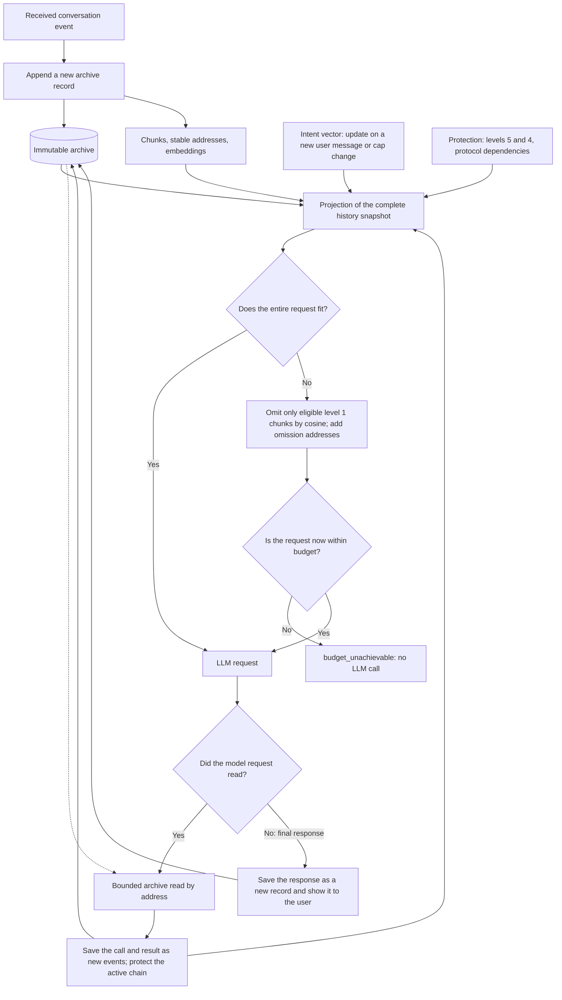

# Reversible Selective Compression of AI Chat History

**Authors:** Алексей Добрый, Талгат Зайниев, кот Вервульф и человечество через GPT-5.6 Sol.

**Status:** concept. The architecture is in technical design. Benchmarks and experimental evidence of its effectiveness have not yet been presented.

**Original language:** the author writes and thinks in Russian. The English version is a translation only; where meanings differ, the Russian version is authoritative.

**Article license:** [Creative Commons Attribution 4.0 International (CC BY 4.0)](https://creativecommons.org/licenses/by/4.0/deed.ru). The text may be shared and adapted with attribution and a link to the source.

## The history is still on screen, but no longer in the model's context

This idea grew out of long conversations with AI. The discussion continues, but the context window fills up. Parts of the history stop being included in requests or are replaced with a short summary. Details that matter to the conversation may disappear with them. It feels as though the LLM suddenly gets “dumber” halfway through the discussion.

What makes this particularly frustrating is that the history is still right there. I can scroll back and read the relevant passage, while the model no longer receives that text in its current request.

I want to keep the conversation going even when sending it in full is no longer sensible or possible. My proposal is to keep an immutable archive and choose which parts to send to the model before each request. Omissions should have addresses: the model can see that some history is missing and read it if needed.

For now, this is a system design. Its effectiveness remains to be tested.

## Abstract

The conversation history is stored in an append-only archive. Messages are divided into addressable chunks with embeddings. Before each LLM call, the application creates a temporary projection of the full archive. If it exceeds the budget, the least semantically similar eligible chunks are omitted, using the user's recent intent as the reference. Mandatory instructions, the protected recent portion of the conversation, and dependencies of unfinished work remain in the request. Pointers mark the omissions. A single MCP tool, `read`, lets the model read original messages, chunks, structural elements, and text artifacts, search for information, and retrieve the entire history page by page. The reducer uses no generative LLM and produces no summary. It reduces only the outgoing copy; the archive remains unchanged. Evaluation must establish whether this saves tokens and cost without an unacceptable decline in answer quality.

## The archive stays unchanged; only the outgoing context changes

The conversation has two representations. The **archive** contains the original messages and events received by the application. A **projection** is the context prepared for a particular model call.

Stored records cannot be shortened, replaced with summaries, or rewritten. Corrections and continuations are appended as new events. Changes to labels are recorded separately and do not alter the original text.

For each request, the application takes a complete snapshot of the history at that point. If everything fits within the budget, it sends the history in full. Otherwise, eligible fragments are omitted from the temporary copy. The remaining text retains its original chronological order, with addresses marking the gaps.

The next request considers the whole archive again. An omitted chunk can return when the topic changes or the user comes back to an earlier question. Its archive record stays the same throughout.

The archive's completeness is limited by what the application actually received. If an external tool returned a truncated result, the missing text cannot be recovered from it. That incompleteness must be explicit. If a stream is interrupted, the received portion is saved as `incomplete`; any continuation is appended separately.

For images, audio, and other non-text data, the system retains originals or references with an indication of availability. Only available text is indexed; no fictitious text embeddings are created for opaque content.

The selected implementation calls for a separate SQLite database. It will hold the archive, chunks, embeddings, annotations, and derived indexes. Original events are kept separate from data that can be recomputed; there is no need to put everything in one wide table. The application saves messages automatically. The model does not decide what to archive or call a separate `save` tool.

## Making the history addressable

A chunk belongs to one message. User text, assistant responses, and tool results are not mixed. A long message can be split into independently omittable parts; a single response does not necessarily have to be sent in full.

Chunking needs to respect headings, paragraphs, lists, tables, quotations, and code blocks. A large table can be divided into groups of rows, retaining the necessary headers and marking omissions in the outgoing representation. A partial table must not look complete, and an original total must not be mistaken for the sum of the remaining rows. A large code block can also be split, but an individual fragment must not be presented as a complete program.

Each chunk receives a stable number, an exact source span, an embedding, and protection metadata. The spans must cover the message without gaps or overlaps: joining the fragments must reproduce the original text, including spaces, line breaks, and Markdown formatting.

To make a fragment understandable, its supporting representation may repeat a heading or table header. Such repetition does not become a new archive event. Its tokens count toward both the model request and the input used to compute the embedding.

Once fixed, chunk numbers and boundaries remain stable through reduction and session resumption. An algorithm update must not silently rechunk old history. Embeddings are tied to their exact input and the revision of its preparation: the same phrase under different headings or with different structural context already constitutes a different input.

## What must remain in context

Semantic similarity can guide the selection of older history. Mandatory instructions and ongoing work are protected separately through each chunk's `protection_level`.

The five values describe the reason for protection, not a sequence of removal queues.

| Level | Purpose | Behavior in the first version |
|---:|---|---|
| 5 | Mandatory system, initial, and security prompts | Never omitted regardless of similarity; tool definitions are also part of the mandatory environment |
| 4 | The last four user turns and necessary dependencies of unfinished work | Never omitted; the label is updated as the protected recent window moves |
| 3 | Reserved for future tool-based protection of important chunks | Not assigned yet |
| 2 | Reserved for future tool-based protection of important chunks | Not assigned yet; its distinction from level 3 is still undefined |
| 1 | All other chunks by default | May be omitted according to semantic similarity when the budget is insufficient |

Level 5 is determined by trusted provenance within the application. Text in an old message or tool result cannot declare itself a system instruction.

A **user turn** starts with a user message and includes subsequent LLM responses, system events, tool calls, and tool results until the next user message. By default, the current turn and the three preceding turns are protected. If fewer than four turns exist, all are protected.

When the fifth turn starts, the oldest leaves the protected recent window. Its completed chunks move from level 4 to level 1. Necessary dependencies of unfinished work remain protected. Level 5 chunks retain their level when they enter the recent window.

The current user request is sent in full. Received steps in the active tool interaction chain, including errors and read results, are protected at level 4. Using a result does not remove its protection. This rule also applies to retries and after `resume`.

The model will not yet be able to pin important chunks outside the recent window: the tool for levels 2 and 3 has been deferred. The first version therefore needs no classifier for “important facts” or “accepted decisions.” The grounds for protection are already defined: provenance, membership in the recent window, and dependencies of unfinished work. An important old fact can become eligible for filtering once it leaves the window. Selection or a subsequent archive read must find it.

## How the system identifies the current topic

“Let's take the second option” says little about the task without the preceding discussion. Selection therefore uses a **recent-intent vector**: an embedding of a coherent portion of the conversation.

“Intent” here is a way to represent the current topic. The name does not imply that an embedding identifies the user's goal without error.

The window includes user messages and the assistant's text responses. Tool calls, tool results, and system/developer messages are excluded. A large tool output should therefore not redirect selection on its own.

The window is constructed as follows:

1. At the time of a new user message, select all eligible user/assistant chunks. Denote their count by `N`.
2. Take the last `ceil(0.05 * N)` chunks in that sequence. This is 5% of eligible chunks, not 5% of all archive events or tokens.
3. Extend the start back to a user-turn boundary and, if necessary, to the configured minimum number of turns. That minimum still needs to be approved.
4. Assemble the selected user/assistant texts in their original order, with roles identified. Include the current request in full.
5. If the window exceeds its cap, remove the oldest completed turns from the window in full. The cap takes precedence over the minimum turn count.

For example, with 200 eligible chunks and 800 tool chunks, the system first selects the last 10 eligible chunks, then adjusts the turn boundary. Tool chunks do not enter the denominator.

By default, the intent window is capped at **30 000 tokens**; the cap can be changed in settings. This limits the selected text, not the embedding model's accepted input size. If the text does not fit in one input, it must be split, embedded in parts, and the resulting vectors aggregated. The aggregation formula still needs agreement and testing. Averaging old embeddings of historical chunks is not a substitute for a new embedding of the selected coherent text.

Even if the current request alone exceeds the window cap, it is not truncated. The text is processed in parts, the vectors are aggregated, and the exception to the window cap is recorded explicitly.

A new user message or a change to the window cap triggers vector recomputation. An assistant response or tool result does not do so on its own. Between updates, the direction of selection remains unchanged, even as the archive grows and the projection changes.

**The intent window guides selection; the protected recent window prevents recent work from being omitted.** If an older turn leaves the intent window but is still inside the protected recent window, it keeps level 4.

This choice has a limitation: “this error” may refer to a tool result that is not part of the intent window. That case needs testing. Tool output must not be silently added to the window merely to obtain a convenient result.

## Building the next request

Before the next call to the main LLM, the application obtains a complete archive snapshot, active instructions, tool definitions, protection labels, and the intent vector. It builds the outgoing context in this order:

1. Identify the mandatory set: levels 5 and 4, plus the necessary protocol environment.
2. Check the size of the entire history together with that environment. If it fits, send it in full.
3. If the budget is insufficient, consider only level 1 chunks with no active protection.
4. Omit the least similar chunks from the outgoing copy. When similarity is equal, omit the older chunk first.
5. Add omission addresses, recalculate the size of the complete request, and continue until it fits or no further omissions are allowed.
6. Send the remaining context in its original chronological order.

The ranking principle:

```text
relevance(chunk) = cosine(embedding(chunk), intent_vector)
candidates = level 1 chunks with no active protection
omission order = ascending relevance, then oldest to newest
```

Protected chunks are not candidates. The numerical label is not used as a multiplier of semantic similarity.

The size calculation covers the entire prepared request: instructions, tool schemas, the query, history, wrappers, and markers. Omitting one chunk does not necessarily reduce the total, because a pointer takes its place. The resulting request must therefore be measured, rather than merely adding up the sizes of removed fragments.

Reduction does not need a generative LLM. The embedding model uses machine learning, but a deterministic algorithm operates on the resulting vectors and labels. Identical inputs and rules should produce identical results. Similarity scores and reasons for omission make the selection explainable.

The projection is recomputed before **every model request**, including after a tool response. The intent vector follows its own update rules and may remain unchanged.

## The budget and explicit failure

Input size can be controlled through `model | percent | tokens` modes: use the available model window, specify a fraction of it, or set an explicit token count. The output reserve and protocol constraints are taken into account. The exact formula, a reliable token-counting method, and behavior when the window size is unknown still need to be defined. An approximate estimate provides no strict guarantee.

No separate arbitrary reserve is allocated for reading history. Tool schemas and actual results count toward the total. A `read` page can use the space left after mandatory context and its envelope.

**If the mandatory set does not fit, the application returns `budget_unachievable` without calling the LLM.** It does the same if all permitted omissions have been exhausted and the request still exceeds the limit. It must not proceed by silently removing level 4 protection, shortening the recent window, increasing the budget, or dropping a step from the active chain. The archive remains unchanged when the request fails.

Unavailable embeddings do not prevent sending the history in full if it fits; indexing remains incomplete. If semantic reduction is needed, the request stops with a diagnostic. A zero or lexical score must not be substituted for cosine similarity.

If an event cannot be durably saved because storage is full, the application reports an error and stops further model activity that depends on that record. It must not silently delete old history or acknowledge a save that did not happen.

## A single read tool for returning to omitted passages

One read-only MCP tool, `read`, is used to return to omitted text. An address identifies what to read: a message, chunk, structural element, virtual file, or search result.

| Address | What it returns |
|---|---|
| `read//m42` | the original message |
| `read//c184` | chunk number 184 |
| `read//c184 - c190` | a range of chunks, including both endpoints |
| `read//n905` | a structural element, such as a section, table, or cell |
| `read//f7` | the contents of a virtual text file |
| `read//messages`, `read//chunks`, `read//nodes`, `read//files` | the corresponding table of contents or catalog |
| `read//history` | the complete chronological history, in pages |
| `read//settings` | available effective settings |

Short addresses have full forms, such as `read//chunks/184` and `read//files/f7`. The `read//` notation denotes a tool invocation, not a network URL. An individual object's address returns its contents; a collection address returns a table of contents. Metadata is requested separately, for example through `read//f7?view=meta`.

Search and reading neighboring chunks use the same tool:

```text
read//c184/neighbors?before=2&after=2
read//search/literal?q=parse_config
read//search/literal?q=parse_config&scope=f7
read//search/semantic?q=авторизация&scope=files
read//search/jsonpath?q=$.nodes[?@.kind=='heading']
```

The examples show search parameters in human-readable form; they must be encoded unambiguously when transmitted. The complete argument schema and exact grammar still need to be defined.

Search covers the entire authorized archive, including material outside the projection. Semantic search uses an embedding of a separate search query and does not change the conversation's intent vector. Address-based and literal reads must work without an embedding service. Read-only mode prohibits changes to source objects and settings, but permits semantic search to call the agreed embedding provider.

At an omission, the model receives the address of the excluded range, such as `read//c184 - c190`. The exact marker format is still to be finalized. Knowing the context is incomplete, the model can open that range or search when the user asks “as we decided earlier.”

Large messages, files, and the full history are returned in pages tied to one snapshot. New events must not alter a retrieval already in progress. The size limit includes the response's metadata and envelope. If even a minimal useful page does not fit, the tool returns an explicit failure instead of an endless sequence of empty pages.

A `read` result must enter the next model request and remain protected within the active chain. If the model request fails, a retry must not lose the retrieved text. Parallel reads share the available budget.

An available source does not guarantee a correct answer. The model must notice missing information, read the right passage, and use it correctly. Reversibility makes exact reading possible. Timely retrieval and answer quality must be measured separately.

## Code and diagrams as addressable files

In a long conversation, I also want to return to specific results: code, a diagram, or a text artifact. Every fenced code/diagram/text block from the assistant, including examples, therefore receives a file view automatically.

A virtual file has a stable ID and a link to its source message. If no name is explicitly provided, it stores `name=null`: the application does not invent one from the neighboring paragraph. Ordinary prose does not automatically become a file.

Calling `read//f7` returns the block body without its outer Markdown fences or surrounding prose. A file may span several chunks, using only part of the boundary chunks. Reading it must therefore assemble its exact source spans, not return every overlapping chunk in full.

A file view does not duplicate the message or its embeddings. A new artifact version receives a new ID; the previous version is retained. An identical name alone does not imply replacement. An artifact left unfinished by an interruption remains marked `incomplete`.

A virtual file does not necessarily correspond to an operating-system file. Reading it does not execute code, apply changes, or copy text to disk. Giving an example an address does not make it a verified program.

The user can separately export the entire archive without reduction to `conversation.md`, preserving chronology, roles, timestamps, and any necessary references to tool results.

## The request path through the system

The diagram separates the immutable archive from the temporary outgoing context. The cycle repeats for every call to the main model, including continuations after reading history.



The diagram shows the main path when embeddings are available. Embedding-service failures, incomplete events, and write errors follow the rules described above. Arrows into the archive mean appending events, not modifying existing records.

## Settings and the selected implementation

Settings should be visible to the user. Through a configuration file or MCP, the user controls the input budget, protected recent-window size, intent window, chunk size, and read limits.

Settings are read through `read//settings` and changed through a separate typed operation, `settings_update`. Reading settings does not change them. Changes take effect at the next applicable stage: a request already sent stays unchanged, and new chunking rules do not rechunk old history. Changing the intent-window cap triggers vector recomputation.

The embedding model is selected when the conversation is created and retained for `resume`. Global settings must not silently replace it within an existing history: incompatible vectors cannot be compared as though they were homogeneous data. The selected model is `text-embedding-3-large` with 3072 dimensions. Working access and integration still need to be confirmed.

The first implementation is planned for an isolated console Codex CLI environment. It will support new sessions and their resumption. Importing old conversations, branching, and history rollback are not yet in scope. On `resume`, the system must restore the full archive, stable addresses, and grounds for protection, not merely the last reduced request.

The same mechanism can be used in a custom chat application or agent framework if the application controls event storage and request preparation. The main LLM may be cloud-hosted or local; the concept is not tied to one model.

An external MCP server alone solves only part of the problem. The [Codex MCP documentation](https://learn.chatgpt.com/docs/extend/mcp?surface=cli) describes STDIO and Streamable HTTP, tools, and server instructions. This provides access to external memory, but does not establish a mechanism for rewriting the client's internal context before every request. The complete design requires integration into request construction, for example in a modified client or a custom wrapper. The SDK and app-server remain possible integration mechanisms; the chosen approach will need verification and maintenance across updates.

## How the design differs from existing approaches

Vector search, external memory, history truncation, and reading tools already exist. I see possible independent value in combining a complete immutable archive, a subtractive projection before every request, protection for ongoing work, omission addresses, and a single way to read the sources.

The reducer starts with the whole history and omits eligible parts until it meets the budget. A typical retrieval-based approach assembles context from retrieved fragments. This difference in mechanism does not by itself demonstrate superiority over RAG.

Summarization may lose exact numbers, wording, arguments, and reasons for decisions. If the source is unavailable, a summary alone cannot recover them. But a summarization-based system can also keep an archive. Comparisons must cover complete systems, including access to the original text.

| Approach | Similarity | Difference from the proposed design |
|---|---|---|
| [MemGPT](https://arxiv.org/abs/2310.08560) | external memory and moving data between memory tiers | this design emphasizes a deterministic subtractive projection of the original chat and omission addresses |
| [Generative Agents](https://arxiv.org/abs/2304.03442) | selecting memories by relevance, recency, and importance | that work concerns agent behavior; this article concerns the outgoing history of a working conversation |
| [LongMemEval](https://arxiv.org/abs/2410.10813) | evaluating long-term memory, knowledge updates, and temporal reasoning | it is a benchmark, not a complete context manager |
| [Semantic Kernel reducers](https://learn.microsoft.com/en-us/semantic-kernel/concepts/ai-services/chat-completion/chat-history) | history truncation and summarization | the documented methods alone do not define the full combination of an immutable archive, addresses, and retrieval |
| [OpenAI compaction](https://developers.openai.com/api/docs/guides/compaction) | reducing context in long conversations | the documentation describes a compaction item that is opaque to humans; this design provides addressable source texts |
| [OpenAI file search](https://developers.openai.com/api/docs/guides/tools-file-search) | semantic and keyword search over a vector store | it is a retrieval tool; managing the entire history and budget requires separate logic |

Of these works, MemGPT seems to me the closest architectural analogue. This is the author's assessment, not an exhaustive review. The article does not establish priority for the idea or claim that this combination of mechanisms exists nowhere else.

## Expected benefits and limitations

My starting assumption is that the next answer often needs only part of a long conversation. Good selection could reduce the input and increase the proportion of useful information. More text does not guarantee that the model will use everything important, either. [Lost in the Middle](https://arxiv.org/abs/2307.03172) examines that problem, but does not demonstrate the effectiveness of this reducer.

The reducer writes no summary, so it introduces no hallucinations into a retelling and no errors from repeated summarization. Reduction requires no additional generative LLM call. Selection, search, and answer errors remain possible; embeddings and additional reads also cost time and money.

With a history of 100 000 tokens and an outgoing context of 20 000, the theoretical input reduction is 80%. This is an arithmetic illustration, not an experimental result. Actual savings depend on pricing, prompt/KV cache, embeddings, and additional model calls following MCP calls.

Semantic search may miss an exact ID, number, or name, so literal search is provided alongside it. A retrieved fact may, in turn, have been superseded by a later message. Having an archive does not by itself resolve which information is current.

The current tool interaction chain must retain the required native protocol. Older completed tool events are intended to appear in the projection as text, with their role, type, call ID, and source address. The original payload stays in the archive. This representation permits independent selection of parts of older history while preserving active protocol dependencies and recent-window protection. The precise transition boundary still needs integration testing.

| Risk | Basis | Likelihood | Mitigation |
|---|---|---|---|
| Losing a significant fact in the answer | a semantic selection error, topic change, missing follow-up read, or outdated result | medium, preliminary estimate | protected recent window, address-based and literal reads, tests of returning to a topic and updating facts |
| Failing to save resources or fit the budget | mandatory recent context, the active chain, markers, and repeated reads take up space | medium, preliminary estimate | complete request accounting, bounded pages, explicit failure, measurement of whole-turn cost and latency |
| History leakage or treating old instructions as new ones | the archive and retrieved fragments may contain sensitive information and prompt injection | medium, preliminary estimate | isolation, encryption, access control, preserved provenance; historical text is treated as data |

The likelihoods are preliminary estimates for planning checks; no measurements are available yet.

The archive is not silently deleted because of its age or size. Storage limits and behavior when resources run out need to be defined separately. The reducer does not free space by deleting history, and immutable records do not imply unlimited disk space or memory.

## How to test the idea

The implementation itself must be checked first: immutable records, exact fragment reconstruction, stable addresses, recent-window protection, budget compliance, and `resume`. Verification must reach the actual request sent to the model. An intermediate reducer result alone is insufficient.

The initial acceptance process calls for structural tests and a fixed corpus of long conversations. It should cover topic changes and returns to earlier topics, references to previous statements, large tool outputs, corrections to earlier facts, and successive reads. These checks do not yet establish the quality of the main LLM's answers.

The broader hypothesis must be tested by comparing at least three modes: full context, summarization, and selective reduction. The main model, embedding model, conversations, chunking, budget, and protection rules must be fixed. Experiments with the main LLM require a separately agreed stage; no results are available yet.

| Metric | What is measured | Proposed calculation |
|---|---|---|
| Input-token reduction | how much smaller the outgoing context is | `1 - reduced_input_tokens / full_input_tokens` |
| Cost | embeddings, the main request, and continuations after MCP reads | total cost per turn and for the whole conversation |
| Latency | reduction, retrieval, and response generation | median, p95, and p99 time to first token and to the complete response |
| Retrieval count | how often omitted history is read | MCP calls per turn and the proportion of turns involving retrieval |
| Evidence Recall | availability of passages needed for the answer | proportion of reference evidence in the initial or retrieved context |
| Loss of significant context | missed facts, decisions, and constraints | proportion of answers with a critical error caused by reduction |
| Answer quality | changes in the final result | automated evaluation and blind human review |
| Incorrect retrieval | retrieving outdated or irrelevant text | proportion of incorrect context-retrieval calls |
| Stability | reproducibility of selection | matching selected chunks under identical input |

For the single `read` tool, the tool-schema size, call count, and output volume also need to be measured. A short address alone says nothing about savings.

Completing the specification requires precise storage and recovery rules, read and settings schemas, token accounting, the intent-vector aggregation formula, and numerical acceptance thresholds. The window and protection parameters are currently design choices, not a measured optimum.

For me, success would mean substantially fewer tokens and lower cost without a statistically or practically significant increase in lost important facts or answer errors. If a smaller input comes at the price of losing decisions, the original problem remains. If quality holds, there will be grounds to develop the design into a general memory mechanism for chat systems and agents.

Suggestions, counterexamples, and results of independent experiments are welcome in the [project's GitHub Issues](https://github.com/talgatiko/reversible-context-memory/issues). Particularly useful areas to examine are selection after a topic change, protection of ongoing work, read security, and methods for evaluating context loss.

## Main references

- [MemGPT: Towards LLMs as Operating Systems](https://arxiv.org/abs/2310.08560)
- [Generative Agents](https://arxiv.org/abs/2304.03442)
- [LongMemEval](https://arxiv.org/abs/2410.10813)
- [Lost in the Middle](https://arxiv.org/abs/2307.03172)
- [OpenAI: Compaction](https://developers.openai.com/api/docs/guides/compaction)
- [OpenAI: File search](https://developers.openai.com/api/docs/guides/tools-file-search)
- [OpenAI/ChatGPT: Codex MCP](https://learn.chatgpt.com/docs/extend/mcp?surface=cli)
