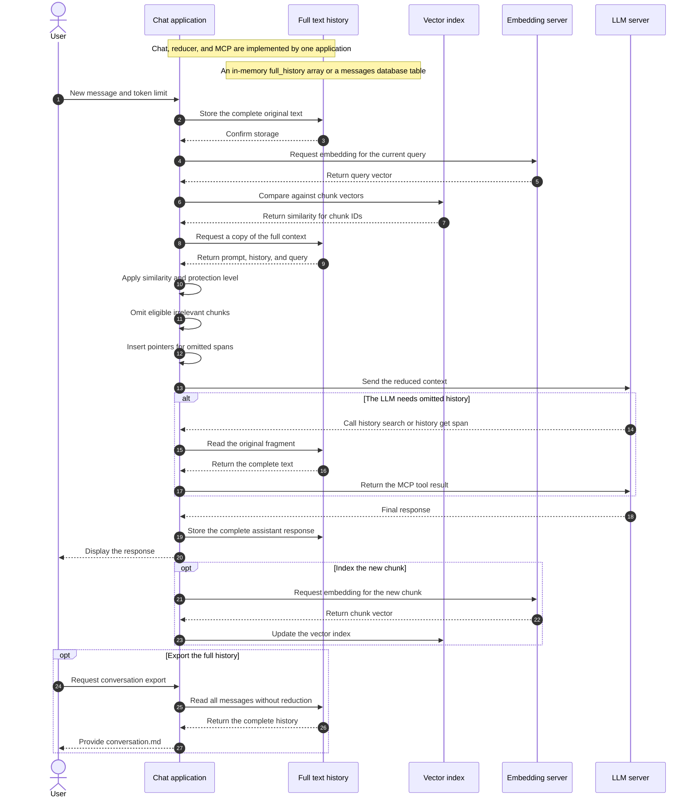

# Reversible Selective Compression of AI Chat History

**Authors:** Алексей Добрый, Талгат Зайниев, кот Вервульф и человечество через GPT-5.6 Sol.

**Status:** concept. A software prototype, benchmarks, and experimental confirmation of effectiveness are not yet available.

**Original language:** the author of the text writes and thinks in Russian. This English version is only a translation; if meanings diverge, the Russian version is authoritative.

**Article license:** [Creative Commons Attribution 4.0 International (CC BY 4.0)](https://creativecommons.org/licenses/by/4.0/). The text may be shared and adapted with attribution and a link to the source.

## Abstract

Long AI chats require an ever-growing history to be sent to the model, increasing request cost and latency and potentially making important information harder for the model to use. The proposed system stores the full conversation history as canonical text, divides it into addressable chunks, and precomputes embeddings for those chunks. Before every LLM call, a deterministic algorithm temporarily removes the least relevant and least protected chunks from a copy of the existing context until a user-selected token limit is reached. Fragments omitted from the request are not destroyed: explicit pointers remain in their place, allowing the model to recover the original text through MCP tools provided by the same chat application. Reduction requires no generative LLM and creates no irreversible summary, so the same conversation can be reduced differently for each new request. The proposal is currently a concept without a prototype or benchmarks; its value must be tested through token savings, cost, latency, answer quality, and the ability to recover significant facts.

## What Is Specifically Being Proposed as New

Vector search, external memory, history truncation, and MCP tools already exist independently. The proposed novelty is not a single component but their combination as one reversible context-management mechanism:

1. The system starts with a copy of the already existing full context and performs **subtractive reduction**, rather than constructing a new context from retrieved fragments as conventional RAG does.
2. Reduction runs deterministically before every request, without a generative LLM and without AI summarization.
3. Exclusion decisions jointly consider embedding similarity, a chunk protection level from 1 to 5, a protected recent conversation tail, and a user-controlled token budget.
4. Addressable pointers remain in place of omitted spans, while the complete original text is preserved as the canonical history.
5. The same system exposes MCP tools that let the LLM search for and precisely recover a chunk, neighboring messages, a span, or the full history.
6. The user controls the amount of context sent, rather than merely selecting a model with a fixed context window.

The central formulation of the idea is: **reversible dynamic reduction of chat history with addressable recovery of the original text**.

## Reduction Without a Generative LLM

The primary reduction procedure requires no separate generative model, summarization, or LLM reasoning. It needs only:

- precomputed embeddings for chunks;
- an embedding of the current request or several latest messages;
- a deterministic similarity calculation;
- an importance or protection label for each chunk;
- a user-defined upper limit for the outgoing message size.

An embedding model is itself a machine-learning model. The precise claim is therefore: **reduction is performed without a generative LLM and without AI summarization; after embeddings have been obtained, an ordinary deterministic algorithm can make the selection decision**.

This provides several benefits:

- no additional generative LLM call for every compression operation;
- no summary hallucinations;
- reproducible results;
- an explainable reason for keeping or omitting each chunk;
- the algorithm can run before every request, not only when the context window overflows.

## Continuous Reduction of the Existing Context

This is not episodic compaction that replaces old history with a summary every few dozen messages, nor is it conventional RAG that builds a new context solely from retrieved fragments. On every turn, the system starts with the already existing full context and performs **subtractive reduction**: it removes the least suitable chunks from the copy that will be sent.

A simplified algorithm is:

1. Add the new message to the full history.
2. Obtain the user-selected token limit for the outgoing request.
3. Build an embedding of the current request. For short references such as “make the second version,” include the recent conversational tail.
4. Compare the request vector with the vectors of all historical chunks.
5. Make a copy of the existing full context: system prompt, history, and current request.
6. Calculate removal priority from vector similarity and the importance or protection label.
7. While the copy exceeds the selected size, remove the least relevant eligible chunks and replace consecutive gaps with compact pointers.
8. Send the system prompt, reduced context, and current request to the LLM.
9. If the remaining context is insufficient, allow the model to read the original history through the built-in MCP interface.

On the next turn, reduction runs again against the full history. A chunk omitted for one request may be retained for another. The algorithm modifies only the outgoing copy, never the original message array or database table.

## Request Flow Through the System

The diagram intentionally avoids HTML markup inside Mermaid so that it can render correctly on GitHub and in editors using different Mermaid versions.



The chat, reducer, and MCP interface are parts of one application and may be implemented in one codebase and process. The full history is a separate **data element** inside that system, such as a `full_history[]` array in memory or a `messages` table in a database. The vector index stores vectors and chunk references, but it does not replace the original text. The full history remains readable through MCP and exportable to the user as a Markdown file.

## Controlling the Outgoing Request Size

The user selects the maximum size of the message sent to the LLM, within the context window of the chosen model. The interface may expose an exact `target_input_tokens` value or modes such as “minimal,” “balanced,” “extended,” and “nearly full.”

The system must reserve space for the answer and service data:

```text
target_input_tokens <= context_window - output_reserve - tool_reserve
```

If the full context is already smaller than the selected limit, no reduction is needed and the history is sent without omitting any historical chunks.

## Chunk Protection Levels from 1 to 5

Semantic similarity alone is insufficient. An important rule may be dissimilar to the current request while still being unsafe to lose. Each chunk therefore receives a `protection_level` describing how readily it may be omitted from the working context.

| Level | Meaning | Examples | Rule |
|---:|---|---|---|
| 1 | Almost freely removable | greetings, repetitions, technical noise | omitted from the working context first |
| 2 | Low protection | completed intermediate discussions | omitted when relevance is low |
| 3 | Normal working context | questions, answers, solution variants | selected according to relevance and budget |
| 4 | Important | confirmed facts, decisions, reasons, unfinished tasks | omitted only under strong budget pressure and remains accessible by pointer |
| 5 | Mandatory | system prompt, active constraints, critical rules | never omitted |

The level can be assigned deterministically according to message type:

- system or developer prompt — 5;
- explicitly pinned rule — 5;
- important fact or accepted decision — 4;
- ordinary conversation — 3;
- completed secondary branch — 2;
- noise and duplicates — 1.

The recent tail is protected dynamically. For example, the latest four logical groups may receive a temporary minimum level of 4. As new messages arrive, the old tail is evaluated under the normal rules again unless a chunk has a permanent reason to remain protected.

The final decision depends on vector similarity and protection:

```text
removal_priority = low_vector_similarity × removability
```

Level-5 chunks are never removed from the outgoing context. For levels 1–4, the system successively omits candidates with the highest removal priority until it reaches the user-selected limit.

## Full History and MCP as a Core Strength

Ordinary summarization is irreversible: after several compression cycles, exact numbers, wording, arguments, errors, and reasons for decisions may disappear.

In the proposed system, full history is preserved as the canonical source: an in-memory array or a database table. Only the temporary copy sent to the LLM is modified. An MCP interface built into the chat application exposes read-only tools to the model:

```text
history_search(query, filters)
history_get_chunk(chunk_id)
history_get_span(span_id)
history_get_neighbors(chunk_id, before, after)
history_get_manifest()
history_get_full(conversation_id, pagination)
```

The ability to inspect the **entire** history is important, but it should be implemented with pagination and token limits. Otherwise, one tool call could fill the entire context window again.

The same canonical history can be exported without reduction as a `conversation.md` file containing chronologically ordered messages, roles, timestamps, and, where needed, references to tool results.

Example pointer:

```text
[HISTORY_OMITTED id=span_42 messages=81..96
 topics="authentication, API"
 retrieve="history_get_span(span_42)"]
```

The model knows in advance that its context is incomplete. If the user says, “as we decided earlier,” the model can resolve the pointer or search the history instead of assuming that the relevant discussion never occurred.

## Expected Benefits

- Fewer input tokens on every request.
- No additional generative LLM for reduction.
- No accumulation of repeated-summarization errors.
- The complete original history remains available.
- The same full chat can be reduced differently for different requests.
- The decision is explainable: scores, protection levels, and omission reasons are retained.
- The approach is not tied to one primary LLM.
- The ratio of useful context to noise may improve.

If a history occupies 100,000 tokens and the working selection contains 20,000, the theoretical input reduction is 80%. This is an illustration, not an experimental result. Actual savings depend on provider pricing, prompt or KV caching, embedding cost, and the number of additional MCP calls.

## Proposed Evaluation Metrics

Evaluation should compare at least three modes: full context, conventional summarization, and the proposed selective reduction. For reproducibility, the primary model, embedding model, conversation dataset, chunking algorithm, token budget, and protection rules should be fixed.

| Metric | What it measures | Proposed calculation |
|---|---|---|
| Input-token reduction | how much smaller the outgoing request became | `1 - reduced_input_tokens / full_input_tokens` |
| Cost | embeddings, primary request, and MCP retrieval expense | total cost per turn and per conversation |
| Latency | effect of reduction and history recovery | median, p95, and p99 time to first token and complete answer |
| Recovery count | how often the LLM requests omitted history | MCP calls per turn and share of turns with recovery |
| Evidence Recall | whether evidence required for the answer remained available | share of reference evidence in initial or recovered context |
| Significant-context loss | whether facts, decisions, or constraints were missed | share of answers with a critical reduction-caused error |
| Answer quality | whether the final output deteriorated | automated evaluation plus blinded human review |
| False recovery | whether an obsolete or irrelevant fragment was retrieved | share of incorrect retrieval calls |
| Stability | whether reducer decisions are reproducible | agreement of selected chunks for identical input |

The key success criterion is a substantial reduction in tokens and cost without a statistically or practically significant increase in lost important facts or answer errors.

## Limitations and Risks

- A necessary chunk may receive low vector similarity.
- Short references such as “that version” require analysis of several recent messages.
- Search may retrieve an old fact superseded by a newer one.
- Chunking must not separate a tool call from its result.
- Frequent MCP calls may reintroduce some latency and cost.
- Full-history storage requires retention, deletion, encryption, and tenant-isolation policies.
- Old messages may contain prompt injection; retrieved history must be treated as data, not as new system instructions.
- Embedding-only retrieval performs poorly for exact IDs, numbers, and names, so full-text search is a useful addition.

A practical implementation can use embeddings as the primary signal, protection levels as a constraint, and exact or full-text search for identifiers, numbers, and names when needed. A generative LLM is still unnecessary for the reduction decision.

## Related Ideas

| Approach | Similarity | Main difference |
|---|---|---|
| [MemGPT](https://arxiv.org/abs/2310.08560) | external memory and tool-based data retrieval | the proposed design emphasizes addressable omissions and a reversible projection of the original chat |
| [Generative Agents](https://arxiv.org/abs/2304.03442) | memory selection by relevance, recency, and importance | a different task without the central concept of pointers to omitted chat spans |
| [LongMemEval](https://arxiv.org/abs/2410.10813) | tests long-term memory, fact updates, and temporal reasoning | a benchmark rather than a complete system |
| [Semantic Kernel reducers](https://learn.microsoft.com/en-us/semantic-kernel/concepts/ai-services/chat-completion/chat-history) | chat-history truncation and summarization | conventional reduction is less reversible |
| [OpenAI compaction](https://developers.openai.com/api/docs/guides/compaction) | reducing the context of long conversations | compact state is opaque, while the proposed memory retains an addressable source of truth |
| [OpenAI file search](https://developers.openai.com/api/docs/guides/tools-file-search) | semantic and keyword search over a vector store | a retrieval tool rather than a complete chat-history manager |

The broad architectural idea is not entirely new; MemGPT is the closest analogue. The potentially distinct contribution is the combination of continuous deterministic reduction, protection levels, explicit pointers, a complete archive, and MCP-based recovery.

## Integration Feasibility

### A Custom Chat Application

This is the best option for an MVP. The application stores `full_history[]`, creates an outgoing copy of the existing context, and subtracts chunks until the user-selected limit is reached. It may use the OpenAI Responses API, another cloud LLM, or a local model.

### Codex Through MCP

The official [Codex MCP documentation](https://learn.chatgpt.com/docs/extend/mcp?surface=cli) states that Codex can connect to STDIO and Streamable HTTP MCP servers and receive their tools and server instructions. Codex can therefore be given the ability to search and read stored history.

MCP itself, however, is not documented as an interceptor that rewrites Codex's internal history before every model request. Two integration levels are therefore possible:

- **MCP without changing Codex:** external memory and fragment recovery, but no guaranteed reduction of Codex's internal context;
- **a modified client or custom wrapper:** full subtractive reduction of the existing context before every request.

### A Codex Fork or Wrapper

Codex has an open repository, an SDK, and an app server. A custom reducer could technically be added to the history-construction pipeline, or new threads could be started with a compact working context connected to MCP memory. This is feasible, but the changes would need maintenance as Codex evolves.

Estimated feasibility:

- custom chat application or agent framework — high;
- external MCP memory for Codex — medium;
- full reduction of standard Codex context through MCP alone — low;
- modified Codex or a custom wrapper — medium to high.

## Discussion and Criticism

Suggestions, objections, counterexamples, and independent experimental results are welcome in the project's [GitHub Issues](https://github.com/talgatiko/reversible-context-memory/issues). The link will become active after the repository is published. Criticism of the removal algorithm, protection scale, MCP recovery security, and context-loss evaluation methodology is especially valuable.

## Conclusion

The proposal is primarily useful for long-running working conversations. Its main strength is not vector search itself but five combined properties:

1. reduction is deterministic and uses no generative LLM;
2. before each request, the least relevant eligible chunks are removed from a copy of the existing context;
3. full history is stored as an array or table, remains available through MCP, and can be exported as Markdown;
4. every chunk has an understandable protection level from 1 to 5;
5. the user controls the outgoing message size within the limits of the LLM.

A small proof of concept is needed to compare full context, summarization, and the proposed system by input tokens, cost, latency, Evidence Recall, MCP recoveries, and answer quality. If savings can be achieved only by losing important decisions, the proposal is not validated. If the system substantially reduces input while preserving quality, it may become a general-purpose memory layer for chat systems and agents.

## Primary Sources

- [MemGPT: Towards LLMs as Operating Systems](https://arxiv.org/abs/2310.08560)
- [Generative Agents](https://arxiv.org/abs/2304.03442)
- [LongMemEval](https://arxiv.org/abs/2410.10813)
- [Lost in the Middle](https://arxiv.org/abs/2307.03172)
- [OpenAI: Compaction](https://developers.openai.com/api/docs/guides/compaction)
- [OpenAI: File search](https://developers.openai.com/api/docs/guides/tools-file-search)
- [OpenAI/ChatGPT: Codex MCP](https://learn.chatgpt.com/docs/extend/mcp?surface=cli)

