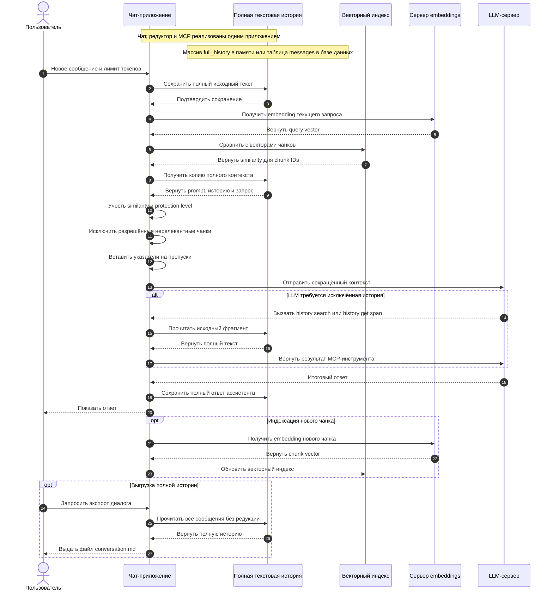

# Обратимое селективное сжатие истории ИИ-чата

**Авторы:** Алексей Добрый, Талгат Зайниев, кот Вервульф и человечество через GPT-5.6 Sol.

**Статус:** концепция. Программный прототип, бенчмарки и экспериментальное подтверждение эффективности пока отсутствуют.

**Язык оригинала:** автор текста пишет и думает на русском языке. Английская версия является только переводом; при смысловых расхождениях исходной считается русская версия.

**Лицензия статьи:** [Creative Commons Attribution 4.0 International (CC BY 4.0)](https://creativecommons.org/licenses/by/4.0/deed.ru). Текст разрешается распространять и перерабатывать при указании авторства и ссылки на источник.

## Abstract

Длинные ИИ-чаты требуют передачи всё большей истории, что увеличивает стоимость и задержку запросов и может ухудшать использование моделью важной информации. Предлагается хранить полную историю диалога как канонический текст, делить её на адресуемые чанки и заранее рассчитывать их embeddings. Перед каждым обращением к LLM детерминированный алгоритм временно исключает из копии существующего контекста наименее релевантные и наименее защищённые чанки, пока не будет достигнут выбранный пользователем лимит токенов. Удалённые из отправки фрагменты не уничтожаются: вместо них остаются указатели, по которым модель может восстановить исходный текст через MCP-инструменты того же чат-приложения. Редукция не требует генеративной LLM и не создаёт необратимое резюме, поэтому один и тот же диалог может по-разному сокращаться под каждый новый запрос. Идея пока является концепцией без прототипа и бенчмарков; её ценность должна быть проверена по экономии токенов, стоимости, задержке, качеству ответов и способности восстанавливать значимые факты.

## Что именно предлагается нового

Векторный поиск, внешняя память, усечение истории и MCP-инструменты по отдельности уже существуют. Предлагаемая новизна находится не в отдельном компоненте, а в их совместном использовании как единого обратимого механизма управления контекстом:

1. Система начинает с копии уже существующего полного контекста и выполняет **вычитательную редукцию**, а не собирает новый контекст из найденных фрагментов, как в классическом RAG.
2. Редукция выполняется перед каждым запросом детерминированно, без генеративной LLM и без ИИ-суммаризации.
3. Решение об исключении учитывает одновременно embedding-близость, уровень защищённости чанка от 1 до 5, защищённый хвост диалога и пользовательский бюджет токенов.
4. На месте исключённых интервалов остаются адресные указатели, а полный исходный текст сохраняется как каноническая история.
5. Та же система предоставляет LLM MCP-инструменты для поиска и точного восстановления чанка, соседних сообщений, диапазона или всей истории.
6. Пользователь управляет размером отправляемого контекста, а не только выбирает модель с фиксированным окном.

Главная формулировка идеи: **обратимая динамическая редукция истории чата с адресным восстановлением исходного текста**.

## Редукция без генеративной LLM

Для основной редукции не требуется отдельная генеративная модель, суммаризация или рассуждение LLM. Достаточно:

- заранее рассчитанных embeddings чанков;
- embedding текущего запроса или нескольких последних сообщений;
- детерминированного расчёта близости;
- пометки важности или защищённости чанка;
- заданного пользователем предельного размера отправляемого сообщения.

Embedding-модель сама является моделью машинного обучения. Поэтому корректная формулировка такова: **редукция выполняется без генеративной LLM и без ИИ-суммаризации; после получения embeddings решение принимает обычный детерминированный алгоритм**.

Это даёт несколько преимуществ:

- нет дополнительного LLM-вызова для каждого сжатия;
- нет галлюцинаций в резюме;
- результат воспроизводим;
- можно объяснить, почему чанк был оставлен или исключён;
- алгоритм можно выполнять перед каждым запросом, а не только при переполнении окна.

## Постоянная редукция существующего контекста

Это не эпизодическая compaction, которая раз в несколько десятков сообщений заменяет старую историю одним резюме, и не классический RAG, собирающий новый контекст только из найденных фрагментов. Система каждый раз начинает с уже существующего полного контекста и выполняет **вычитательную редукцию**: удаляет из отправляемой копии наименее подходящие чанки.

Упрощённый алгоритм:

1. Добавить новое сообщение в полную историю.
2. Получить заданный пользователем предел отправки в токенах.
3. Построить embedding текущего запроса. Для коротких фраз вроде «сделай второй вариант» можно учитывать недавний хвост.
4. Сравнить вектор запроса с векторами всех исторических чанков.
5. Взять копию существующего полного контекста: системный промпт, историю и текущий запрос.
6. Рассчитать приоритет удаления по векторной близости и пометке важности или защищённости.
7. Пока копия превышает выбранный размер, убирать из неё наименее релевантные разрешённые чанки и заменять последовательные пропуски компактными указателями.
8. Передать LLM системный промпт, сокращённый контекст и текущий запрос.
9. Если контекста недостаточно, разрешить модели дочитать исходную историю через встроенный MCP-интерфейс.

На следующем ходу редукция выполняется снова над полной историей. Чанк, исключённый сейчас, может остаться при другом запросе. Алгоритм изменяет только отправляемую копию, но не исходный массив или таблицу сообщений.

## Движение запроса через систему

Диаграмма намеренно не использует HTML-разметку внутри Mermaid, чтобы корректно отображаться в GitHub и редакторах с разными версиями Mermaid.



Чат, редуктор и MCP-интерфейс являются частями одного приложения и могут быть реализованы одним кодом и процессом. Полная история — отдельный элемент **данных** внутри этой системы: например, массив `full_history[]` в памяти или таблица `messages` в базе данных. Векторный индекс хранит векторы и ссылки на чанки, но не заменяет исходный текст. Полная история пригодна для чтения через MCP и для выгрузки пользователю в виде Markdown-файла.

## Управление размером отправки

Пользователь задаёт максимальный размер сообщения, отправляемого LLM, в пределах контекстного окна выбранной модели. Интерфейс может предоставлять точное значение `target_input_tokens` или режимы, например «минимальный», «сбалансированный», «расширенный» и «почти полный».

Система должна резервировать место для ответа и служебных данных:

```text
target_input_tokens <= context_window - output_reserve - tool_reserve
```

Если полный контекст уже меньше выбранного лимита, редукция не требуется и сообщение передаётся без удаления исторических чанков.

## Уровень защищённости чанка от 1 до 5

Одной семантической близости недостаточно. Важное правило может быть непохоже на текущий запрос, но его всё равно нельзя терять. Каждому чанку предлагается присваивать `protection_level` — степень допустимости исключения из рабочего контекста.

| Уровень | Смысл | Примеры | Правило |
|---:|---|---|---|
| 1 | Почти свободно исключаемый | приветствия, повторы, технический шум | первым исключается из рабочего контекста |
| 2 | Низкая защищённость | завершённые промежуточные обсуждения | исключается при низкой релевантности |
| 3 | Обычный рабочий контекст | вопросы, ответы, варианты решения | выбирается по релевантности и бюджету |
| 4 | Важный | подтверждённые факты, решения, причины, незавершённые задачи | исключается только при сильном дефиците бюджета; остаётся доступным по указателю |
| 5 | Обязательный | системный промпт, действующие ограничения, критические правила | не исключается |

Уровень может назначаться детерминированно по типу сообщения:

- system/developer prompt — 5;
- явно закреплённое правило — 5;
- важный факт или принятое решение — 4;
- обычный диалог — 3;
- завершённая второстепенная ветка — 2;
- шум и дубли — 1.

Хвост разговора защищается динамически. Например, последние четыре логические группы получают временный уровень не ниже 4. По мере появления новых сообщений старый хвост снова оценивается по обычным правилам, если у чанка нет постоянного основания оставаться защищённым.

Итоговое решение зависит от векторной близости и защищённости:

```text
приоритет_удаления = низкая_векторная_близость × допустимость_удаления
```

Чанки уровня 5 не удаляются из отправляемого контекста. Для уровней 1–4 система последовательно исключает кандидатов с наибольшим приоритетом удаления, пока не будет достигнут пользовательский лимит.

## Полная история и MCP как сильная сторона

Обычная суммаризация необратима: после нескольких сжатий могут исчезнуть точные числа, формулировки, аргументы, ошибки и причины решений.

В предлагаемой системе полная история сохраняется как канонический источник: массив в памяти или таблица в базе данных. Изменяется только временная копия, отправляемая LLM. Встроенный в чат-приложение MCP-интерфейс предоставляет модели read-only инструменты:

```text
history_search(query, filters)
history_get_chunk(chunk_id)
history_get_span(span_id)
history_get_neighbors(chunk_id, before, after)
history_get_manifest()
history_get_full(conversation_id, pagination)
```

Возможность посмотреть **всю** историю — важная функция, но её следует реализовать с пагинацией и токен-лимитами. Иначе один вызов снова заполнит всё контекстное окно.

Та же каноническая история может быть выгружена без редукции в файл `conversation.md`, содержащий сообщения в хронологическом порядке, роли, время и при необходимости ссылки на результаты инструментов.

Пример указателя:

```text
[HISTORY_OMITTED id=span_42 messages=81..96
 topics="авторизация, API"
 retrieve="history_get_span(span_42)"]
```

Модель заранее знает, что видит неполный контекст. Если пользователь говорит «как мы решили раньше», модель может раскрыть указатель или выполнить поиск, а не предполагать, что нужного обсуждения не существовало.

## Предполагаемая польза

- Сокращение входных токенов при каждом запросе.
- Отсутствие дополнительной генеративной LLM для редукции.
- Нет накопления ошибок многократной суммаризации.
- Полная исходная история остаётся доступной.
- Один и тот же полный чат можно по-разному сокращать под разные запросы.
- Решение объяснимо: сохраняются scores, protection level и причины исключения.
- Подход не привязан к одной основной LLM.
- Повышается отношение полезного контекста к шуму.

Если история занимает 100 000 токенов, а рабочая выборка — 20 000, теоретическое сокращение входа составляет 80%. Это иллюстрация, а не полученный экспериментальный результат. Реальная экономия зависит от тарификации провайдера, prompt/KV cache, стоимости embeddings и числа дополнительных MCP-вызовов.

## Метрики для проверки концепции

Проверка должна сравнивать как минимум три режима: полный контекст, традиционную суммаризацию и предлагаемую селективную редукцию. Для воспроизводимости следует зафиксировать модель, embedding-модель, набор диалогов, алгоритм чанкинга, токен-бюджет и правила защищённости.

| Метрика | Что измеряется | Предлагаемый способ расчёта |
|---|---|---|
| Сокращение входных токенов | насколько уменьшилась отправка | `1 - reduced_input_tokens / full_input_tokens` |
| Стоимость | цена embeddings, основного запроса и MCP-дочитываний | суммарная стоимость одного хода и всего диалога |
| Задержка | влияние редукции и восстановления истории | медиана, p95 и p99 времени до первого токена и полного ответа |
| Число восстановлений | насколько часто LLM запрашивает удалённую историю | MCP-вызовы на ход и доля ходов с восстановлением |
| Evidence Recall | сохранились ли фрагменты, необходимые для ответа | доля эталонных доказательств в первичном или восстановленном контексте |
| Потери значимого контекста | пропущены ли факты, решения и ограничения | доля ответов с критической ошибкой из-за редукции |
| Качество ответа | не ухудшился ли итоговый результат | автоматическая оценка плюс слепая человеческая проверка |
| Ложное восстановление | не был ли извлечён устаревший или нерелевантный фрагмент | доля ошибочных retrieval-вызовов |
| Стабильность | повторяется ли решение редуктора | совпадение выбранных чанков при одинаковом входе |

Ключевой критерий успеха: существенное сокращение токенов и стоимости без статистически или практически значимого роста потерь важных фактов и ошибок ответа.

## Ограничения и риски

- Нужный чанк может получить низкую векторную близость.
- Короткие ссылки вроде «тот вариант» требуют анализа нескольких последних сообщений.
- Поиск может вернуть старый факт, отменённый более новым.
- Разбиение не должно разделять вызов инструмента и его результат.
- Частые MCP-вызовы могут вернуть часть задержки и стоимости.
- Полное хранение истории требует политики retention, удаления, шифрования и изоляции пользователей.
- Старые сообщения могут содержать prompt injection; извлечённая история должна считаться данными, а не новыми системными инструкциями.
- Embedding-only retrieval хуже справляется с точными ID, числами и именами, поэтому полезно добавить полнотекстовый поиск.

Практический вариант — embeddings как основной сигнал плюс protection level и, при необходимости, exact/full-text search для точных ID, чисел и имён. Генеративная LLM для редукции всё равно не требуется.

## Аналогичные идеи

| Подход | Что похоже | Главное отличие |
|---|---|---|
| [MemGPT](https://arxiv.org/abs/2310.08560) | внешняя память и подгрузка данных инструментами | предлагаемая схема делает акцент на адресных пропусках и обратимой проекции исходного чата |
| [Generative Agents](https://arxiv.org/abs/2304.03442) | память выбирается по релевантности, давности и важности | другая задача; нет основной концепции указателей на удалённые интервалы чата |
| [LongMemEval](https://arxiv.org/abs/2410.10813) | тестирует долговременную память, обновление фактов и временное рассуждение | это бенчмарк, а не готовая система |
| [Semantic Kernel reducers](https://learn.microsoft.com/en-us/semantic-kernel/concepts/ai-services/chat-completion/chat-history) | усечение и суммаризация истории | типовая редукция менее обратима |
| [OpenAI compaction](https://developers.openai.com/api/docs/guides/compaction) | уменьшение контекста длинного диалога | компактное состояние непрозрачно; предлагаемая память хранит адресуемый первоисточник |
| [OpenAI file search](https://developers.openai.com/api/docs/guides/tools-file-search) | semantic и keyword search по vector store | это retrieval-инструмент, а не полный менеджер истории чата |

Общая архитектурная идея не является полностью новой: ближайший аналог — MemGPT. Возможная самостоятельная ценность заключается в сочетании постоянной детерминированной редукции, шкалы защищённости, явных указателей, полного архива и MCP-восстановления.

## Возможность интеграции

### Собственное чат-приложение

Это лучший вариант для MVP. Приложение хранит `full_history[]`, создаёт отправляемую копию существующего контекста и вычитает из неё чанки до выбранного пользователем лимита. Можно использовать OpenAI Responses API, другую облачную LLM или локальную модель.

### Codex через MCP

Официальная документация [Codex MCP](https://learn.chatgpt.com/docs/extend/mcp?surface=cli) указывает, что Codex подключается к STDIO и Streamable HTTP MCP-серверам, получает их инструменты и server instructions. Поэтому Codex можно научить искать и читать сохранённую историю.

Но MCP сам по себе не документирован как перехватчик, который переписывает внутреннюю историю Codex перед каждым модельным запросом. Поэтому возможны два уровня:

- **MCP без изменения Codex:** внешняя память и восстановление фрагментов, но не гарантированная экономия внутреннего контекста Codex;
- **изменение клиента или собственная оболочка:** полноценная вычитательная редукция существующего контекста перед каждым запросом.

### Fork или оболочка Codex

Codex имеет открытый репозиторий, SDK и app-server. Технически можно добавить собственный reducer в pipeline формирования истории либо вести новые треды из компактного рабочего контекста с подключённой MCP-памятью. Это реализуемо, но потребует сопровождения изменений при обновлении Codex.

Оценка реализуемости:

- собственный чат или agent framework — высокая;
- внешний MCP для Codex — средняя, как память;
- полноценная редукция штатного контекста Codex через один MCP — низкая;
- модифицированный Codex или собственная оболочка — средне-высокая.

## Обсуждение и критика

Предложения, замечания, контрпримеры и результаты независимых экспериментов предлагается размещать в [GitHub Issues проекта](https://github.com/talgatiko/reversible-context-memory/issues). Ссылка начнёт работать после публикации репозитория. Особенно полезна критика алгоритма удаления, шкалы защищённости, безопасности MCP-восстановления и методики оценки потерь контекста.

## Итог

Идея полезна прежде всего для длинных рабочих диалогов. Её сильная сторона не в самом векторном поиске, а в пяти свойствах:

1. редукция выполняется детерминированно без генеративной LLM;
2. перед каждым запросом из копии существующего контекста удаляются наименее релевантные разрешённые чанки;
3. полная история хранится как массив или таблица, доступна через MCP и выгружается в Markdown;
4. каждый чанк имеет понятный уровень защищённости от 1 до 5;
5. пользователь управляет размером отправляемого сообщения в пределах возможностей LLM.

Для проверки нужен небольшой PoC: сравнить полный контекст, суммаризацию и новую систему по входным токенам, стоимости, задержке, Evidence Recall, MCP-восстановлениям и качеству ответа. Если экономия достигается только ценой потери важных решений, идея не подтверждена. Если система заметно сокращает вход и сохраняет качество, она может стать самостоятельным универсальным слоем памяти для чат-систем и агентов.

## Основные источники

- [MemGPT: Towards LLMs as Operating Systems](https://arxiv.org/abs/2310.08560)
- [Generative Agents](https://arxiv.org/abs/2304.03442)
- [LongMemEval](https://arxiv.org/abs/2410.10813)
- [Lost in the Middle](https://arxiv.org/abs/2307.03172)
- [OpenAI: Compaction](https://developers.openai.com/api/docs/guides/compaction)
- [OpenAI: File search](https://developers.openai.com/api/docs/guides/tools-file-search)
- [OpenAI/ChatGPT: Codex MCP](https://learn.chatgpt.com/docs/extend/mcp?surface=cli)

