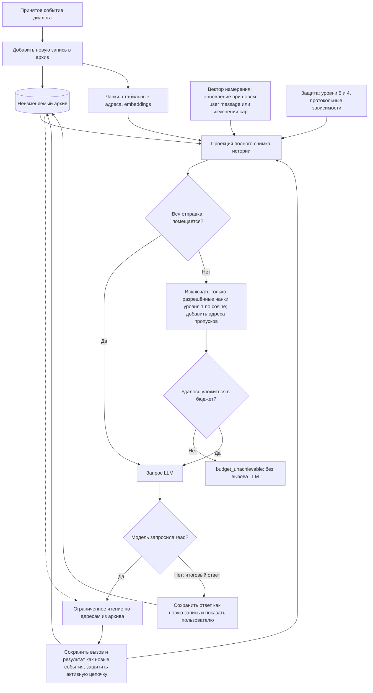

# Обратимое селективное сжатие истории ИИ-чата

**Авторы:** Алексей Добрый, Талгат Зайниев, кот Вервульф и человечество через GPT-5.6 Sol.

**Статус:** концепция. Архитектура находится на стадии технического проектирования. Бенчмарки и экспериментальное подтверждение её эффективности пока не представлены.

**Язык оригинала:** автор текста пишет и думает на русском языке. Английская версия является только переводом; при смысловых расхождениях исходной считается русская версия.

**Лицензия статьи:** [Creative Commons Attribution 4.0 International (CC BY 4.0)](https://creativecommons.org/licenses/by/4.0/deed.ru). Текст разрешается распространять и перерабатывать при указании авторства и ссылки на источник.

## История на экране есть, а в контексте модели её уже нет

Идея выросла из длинных разговоров с ИИ. Обсуждение продолжается, но контекстное окно заканчивается. Часть истории перестаёт попадать в запросы или заменяется кратким пересказом. Вместе с ней могут потеряться сведения, важные для разговора. По ощущению, LLM вдруг «тупеет» посреди обсуждения.

Особенно раздражает, что история по-прежнему перед глазами. Я могу прокрутить разговор и прочитать нужное место, а модель в текущем запросе этого текста уже не получает.

Мне хочется продолжать разговор, даже когда отправлять его целиком уже неразумно или невозможно. Для этого я предлагаю хранить неизменяемый архив и перед каждым запросом выбирать, какие его части передать модели. Пропуски должны иметь адреса: модель видит, что часть истории не включена, и может её прочитать.

Пока это проект системы. Её эффективность предстоит проверить.

## Аннотация

История диалога хранится в архиве, который только пополняется. Сообщения разбиваются на адресуемые чанки с embeddings. Перед каждым обращением к LLM приложение создаёт временную проекцию полного архива. Если она превышает бюджет, из неё исключаются разрешённые чанки, наименее близкие к недавнему намерению пользователя. Обязательные инструкции, защищённый хвост диалога и незавершённые зависимости остаются в отправке. На месте пропусков сохраняются указатели. Через единый MCP-инструмент `read` модель может читать исходные сообщения, чанки, структурные элементы и текстовые артефакты, искать нужные сведения и получать всю историю страницами. Редуктор не использует генеративную LLM и не создаёт резюме. Он сокращает только отправляемую копию; архив остаётся неизменным. Проверка должна показать, даёт ли это экономию токенов и стоимости без неприемлемого ухудшения ответов.

## Архив неизменен, меняется только отправка

Разговор существует в двух представлениях. **Архив** содержит принятые исходные сообщения и события. **Проекция** представляет собой контекст, подготовленный для конкретного обращения к модели.

Уже сохранённые записи нельзя сокращать, заменять резюме или переписывать. Исправления и продолжения добавляются как новые события. Изменения меток записываются отдельно и не затрагивают исходный текст.

Для каждого запроса приложение берёт полный снимок истории на этот момент. Если всё помещается в бюджет, история отправляется целиком. Если нет, из временной копии исключаются разрешённые фрагменты. Оставшийся текст идёт в исходном хронологическом порядке, а на месте пропусков появляются адреса.

На следующем запросе приложение вновь рассматривает весь архив. Пропущенный чанк может вернуться, если разговор сменит тему или пользователь обратится к прежнему вопросу. Его архивная запись всё это время остаётся прежней.

Полнота архива ограничена тем, что приложение действительно приняло. Если внешний инструмент вернул обрезанный результат, отсутствующий текст из него не восстановить. Неполнота должна быть обозначена. При обрыве потока полученная часть сохраняется с отметкой `incomplete`; продолжение добавляется отдельно.

Для изображений, аудио и других нетекстовых данных сохраняются оригиналы или ссылки с указанием доступности. Индексируется только доступный текст; для непрозрачного содержимого фиктивные текстовые embeddings не создаются.

Для выбранной реализации предусмотрена отдельная SQLite-база. В ней будут храниться архив, чанки, embeddings, аннотации и производные индексы. Исходные события отделены от данных, которые можно пересчитать; складывать всё в одну широкую таблицу не требуется. Приложение сохраняет сообщения автоматически. Модель не решает, что архивировать, и не вызывает отдельный `save`.

## Как история становится адресуемой

Чанк принадлежит одному сообщению. Тексты пользователя, ответы ассистента и результаты инструментов не смешиваются. Длинное сообщение можно разбить на части, которые исключаются независимо: один ответ не обязательно передавать целиком.

При разбиении нужно учитывать заголовки, абзацы, списки, таблицы, цитаты и блоки кода. Большую таблицу можно разделить на группы строк, сохранив в отправке необходимые заголовки и обозначив пропуски. Читатель не должен принять частичную таблицу за полную, а исходный итог за сумму оставшихся строк. Большой блок кода тоже можно разделить, но отдельный фрагмент нельзя объявлять готовой программой.

Каждый чанк получает стабильный номер, точный исходный диапазон, embedding и метаданные защиты. Диапазоны должны покрывать сообщение без потерь и перекрытий: соединение фрагментов восстанавливает исходный текст, включая пробелы, переводы строк и Markdown-разметку.

Чтобы фрагмент был понятен, в его служебном представлении можно повторить заголовок или шапку таблицы. Повторение не становится новым событием архива. Его токены учитываются и в отправке модели, и во входе для расчёта embedding.

После фиксации номера и границы чанков сохраняются при редукции и возобновлении сессии. Обновление алгоритма не должно молча перенарезать старую историю. Embeddings связаны с точным входом и версией его подготовки: одна фраза с разными заголовками или другим структурным контекстом уже образует разные входы.

## Что обязательно остаётся в контексте

По смысловой близости можно выбирать старую историю. Обязательность инструкций и текущей работы задаётся отдельно, через `protection_level` каждого чанка.

Пять значений этой метки обозначают основания защиты, а не очереди исключения.

| Уровень | Назначение | Поведение в первой версии |
|---:|---|---|
| 5 | Обязательные системные, начальные и security prompts | Не исключаются независимо от близости; определения инструментов также входят в обязательное окружение |
| 4 | Последние четыре пользовательских хода и необходимые незавершённые зависимости | Не исключаются; метка обновляется при сдвиге хвоста |
| 3 | Резерв будущей инструментальной защиты важных чанков | Пока не назначается |
| 2 | Резерв будущей инструментальной защиты важных чанков | Пока не назначается; отличие от уровня 3 ещё не определено |
| 1 | Все остальные чанки по умолчанию | При нехватке бюджета могут исключаться по семантической близости |

Уровень 5 определяется доверенным происхождением данных в приложении. Текст старого сообщения или результата инструмента не может сам объявить себя системной инструкцией.

**Пользовательский ход** начинается с сообщения пользователя и включает последующие ответы LLM, системные события, вызовы инструментов и их результаты до следующего сообщения пользователя. По умолчанию защищены текущий и три предыдущих хода. Если ходов меньше четырёх, защищены все имеющиеся.

Когда начинается пятый ход, самый старый выходит из хвоста. Его завершённые чанки переходят с уровня 4 на уровень 1. Необходимые зависимости незавершённой работы остаются защищёнными. Чанки уровня 5 при попадании в хвост сохраняют свой уровень.

Текущий запрос пользователя передаётся целиком. Принятые шаги активной цепочки работы с инструментами, включая ошибки и результаты чтения, защищены уровнем 4. Использование результата не снимает с него защиту. Это правило действует и при повторе запроса, и после `resume`.

Закреплять важные чанки вне хвоста модель пока не сможет: инструмент для уровней 2 и 3 отложен. Поэтому первой версии не нужен классификатор «важных фактов» и «принятых решений». Основания защиты уже заданы: происхождение, принадлежность к хвосту и незавершённые зависимости. Старый важный факт после выхода из хвоста может попасть в фильтруемый набор. Найти его должны отбор или последующее чтение архива.

## Как система определяет текущую тему

Фраза «Берём второй вариант» без предшествующего разговора мало что говорит о задаче. Поэтому отбор опирается на **вектор недавнего намерения**: embedding связного фрагмента диалога.

«Намерение» здесь означает способ представить текущую тему. Это название не предполагает, что embedding безошибочно распознаёт цель пользователя.

В окно входят сообщения пользователя и текстовые ответы ассистента. Вызовы инструментов, их результаты и system/developer-сообщения исключены. Так большой вывод инструмента не должен сам по себе менять направление отбора.

Окно строится так:

1. На момент нового сообщения пользователя выбираются все подходящие user/assistant-чанки. Их количество обозначается `N`.
2. Берутся последние `ceil(0.05 * N)` чанков этой последовательности. Это 5% подходящих чанков, а не 5% всех событий или токенов архива.
3. Начало расширяется до границы пользовательского хода и, при необходимости, до настроенного минимума ходов. Значение этого минимума ещё предстоит утвердить.
4. Выбранные user/assistant-тексты собираются в исходном порядке с обозначением ролей. Текущий запрос включается полностью.
5. Если окно превышает установленный предел, самые старые завершённые ходы убираются из окна целиком. Предел важнее минимума ходов.

Например, при 200 подходящих чанках и 800 чанках инструментов сначала выбираются последние 10 подходящих чанков, после чего уточняется граница хода. Инструментальные чанки не входят в знаменатель.

По умолчанию окно намерения ограничено **30 000 токенов**; предел можно изменить в настройках. Это ограничение выбранного текста, а не допустимого входа embedding-модели. Если текст не помещается в один input, его нужно разделить, получить embeddings частей и агрегировать их. Формулу агрегации ещё предстоит согласовать и проверить. Усреднение старых embeddings исторических чанков не заменяет новый embedding выбранного связного текста.

Даже если текущий запрос сам превышает предел окна, его не обрезают. Текст обрабатывается частями, векторы агрегируются, а исключение из ограничения окна явно фиксируется.

Новое сообщение пользователя или изменение предела окна запускает пересчёт вектора. Ответ ассистента и результат инструмента сами по себе этого не делают. Между обновлениями направление отбора остаётся прежним, хотя архив пополняется, а проекция меняется.

**Окно намерения направляет отбор, защищённый хвост запрещает исключать недавнюю работу.** Если старый ход убран из окна намерения, но ещё входит в хвост, его уровень 4 сохраняется.

У этого решения есть ограничение: «эта ошибка» может относиться к результату инструмента, который не входит в окно намерения. Такой случай нужно проверить в испытаниях. Незаметно добавлять вывод инструментов в окно ради удобного результата нельзя.

## Как формируется очередной запрос

Перед очередным обращением к основной LLM приложение получает полный снимок архива, действующие инструкции, определения инструментов, метки защиты и вектор намерения. Отправка формируется в следующем порядке:

1. Определяет обязательный набор: уровни 5 и 4, а также необходимое протокольное окружение.
2. Проверяет размер всей истории вместе с окружением. Если она помещается, отправляет её целиком.
3. При дефиците бюджета рассматривает только чанки уровня 1 без действующей защиты.
4. Исключает из отправляемой копии наименее близкие чанки. При одинаковой близости первым исключается более старый.
5. Добавляет адреса пропусков, пересчитывает размер полной отправки и продолжает, пока она не уложится в бюджет либо не исчерпаются допустимые исключения.
6. Передаёт оставшийся контекст в исходном хронологическом порядке.

Принцип ранжирования:

```text
relevance(chunk) = cosine(embedding(chunk), intent_vector)
кандидаты = чанки уровня 1 без действующей защиты
порядок исключения = по возрастанию relevance, затем от старых к новым
```

Защищённые чанки не входят в кандидаты. Численное значение метки не используется как множитель семантической близости.

Размер считается для всей подготовленной отправки: инструкций, схем инструментов, запроса, истории, служебных оболочек и маркеров. Исключение одного чанка не обязательно уменьшает объём, поскольку на его месте появляется указатель. Поэтому нужно измерять получившуюся отправку, а не только суммировать размеры убранных фрагментов.

Генеративная LLM для редукции не нужна. Embedding-модель относится к машинному обучению, но по готовым векторам и меткам работает детерминированный алгоритм. Одинаковые входы и правила должны давать одинаковый результат. Оценки близости и причины исключения делают выбор объяснимым.

Проекция пересчитывается перед **каждым модельным запросом**, в том числе после ответа инструмента. Вектор намерения обновляется по своим правилам и при этом может остаться прежним.

## Бюджет и явный отказ

Размером входа можно управлять в режимах `model | percent | tokens`: использовать доступное окно модели, задать долю окна или явное число токенов. При этом учитываются резерв ответа и протокольные ограничения. Ещё нужно определить точную формулу, надёжный способ подсчёта токенов и поведение при неизвестном окне. Приблизительная оценка не даёт строгой гарантии.

Отдельный произвольный резерв для чтения истории не закладывается. Схемы инструментов и фактические результаты входят в общий размер. Для страницы `read` остаётся место после обязательного контекста и служебной оболочки.

**Если обязательный набор не помещается, приложение возвращает `budget_unachievable` и не вызывает LLM.** Оно поступает так же, если разрешённые исключения закончились, а отправка всё ещё превышает лимит. Продолжать за счёт скрытого снятия уровня 4, сокращения хвоста, повышения бюджета или потери шага активной цепочки нельзя. Архив при отказе остаётся неизменным.

Недоступность embeddings не мешает отправить историю целиком, если она помещается; индексация при этом остаётся незавершённой. Если нужна семантическая редукция, запрос останавливается с диагностикой. Подменять cosine similarity нулевой или лексической оценкой нельзя.

Если событие не удаётся надёжно записать из-за нехватки места, приложение выдаёт ошибку и останавливает дальнейшее модельное действие, которому нужна эта запись. Оно не должно молча удалять старую историю или подтверждать несостоявшееся сохранение.

## Единый read: вернуться к пропущенному месту

Для возвращения к пропущенному тексту выбран один read-only MCP-инструмент `read`. Объект чтения задаётся адресом: это может быть сообщение, чанк, структурный элемент, виртуальный файл или результат поиска.

| Адрес | Что возвращается |
|---|---|
| `read//m42` | исходное сообщение |
| `read//c184` | чанк с номером 184 |
| `read//c184 - c190` | диапазон чанков, включая оба конца |
| `read//n905` | структурный элемент: например, раздел, таблица или ячейка |
| `read//f7` | содержимое виртуального текстового файла |
| `read//messages`, `read//chunks`, `read//nodes`, `read//files` | соответствующее оглавление или каталог |
| `read//history` | полная хронологическая история, страницами |
| `read//settings` | доступные эффективные настройки |

У коротких адресов есть полные формы, например `read//chunks/184` и `read//files/f7`. Запись `read//` обозначает обращение к инструменту и не является сетевым URL. По адресу конкретного объекта возвращается содержимое, по адресу коллекции оглавление. Метаданные запрашиваются отдельно, например через `read//f7?view=meta`.

Поиск и чтение соседей используют тот же инструмент:

```text
read//c184/neighbors?before=2&after=2
read//search/literal?q=parse_config
read//search/literal?q=parse_config&scope=f7
read//search/semantic?q=авторизация&scope=files
read//search/jsonpath?q=$.nodes[?@.kind=='heading']
```

В примерах поисковые параметры записаны для чтения человеком; при передаче они должны однозначно кодироваться. Полную схему аргументов и точную грамматику ещё нужно определить.

Поиск охватывает весь разрешённый архив, включая то, что не вошло в проекцию. Semantic search использует embedding отдельного поискового запроса и не меняет вектор намерения диалога. Адресное и literal-чтение должны работать без embedding-сервиса. Режим read-only запрещает менять исходные объекты и настройки, но допускает обращение семантического поиска к согласованному embedding-провайдеру.

На месте пропуска модель получает адрес исключённого диапазона, например `read//c184 - c190`. Точный формат маркера ещё предстоит закрепить. Зная о неполноте контекста, модель может в ответ на «как мы решили раньше» открыть диапазон или выполнить поиск.

Большие сообщения, файлы и полная история возвращаются страницами, привязанными к одному снимку. Новые события не должны менять начатую выдачу. Ограничение размера учитывает и служебные поля ответа. Если даже минимальная полезная страница не помещается, инструмент возвращает явный отказ вместо бесконечной последовательности пустых страниц.

Результат `read` обязательно попадает в ближайший запрос модели и сохраняет защиту в активной цепочке. Если модельный запрос завершился ошибкой, при повторе полученный текст нельзя потерять. Параллельные чтения делят общий доступный бюджет.

Доступный исходник ещё не означает правильного ответа. Модель должна заметить нехватку сведений, прочитать нужное место и верно его использовать. Обратимость даёт возможность точного чтения. Своевременность восстановления и качество ответа нужно измерять отдельно.

## Код и диаграммы как адресуемые файлы

В длинном разговоре я хочу возвращаться и к конкретным результатам: коду, диаграмме, текстовому артефакту. Поэтому каждый выделенный fenced code/diagram/text block ассистента, включая примеры, автоматически получает файловое представление.

У виртуального файла есть стабильный ID и связь с исходным сообщением. Без явно заданного имени хранится `name=null`: приложение не придумывает название по соседнему абзацу. Обычная проза автоматически файлом не становится.

Обращение `read//f7` возвращает тело блока без внешних Markdown-ограждений и соседней прозы. Файл может занимать несколько чанков, причём крайние входят в него лишь частично. Поэтому чтение собирает точные исходные диапазоны, а не выдаёт все пересекающиеся чанки целиком.

Файловое представление не дублирует сообщение и его embeddings. Новая версия артефакта получает новый ID; старая сохраняется. Одинаковое имя само по себе не означает замены. Артефакт, не завершённый из-за обрыва, остаётся помеченным как `incomplete`.

Виртуальному файлу не обязательно соответствует файл операционной системы. Чтение не запускает код, не применяет изменения и не копирует текст на диск. У примера появляется адрес, но это не делает его проверенной программой.

Пользователь может отдельно экспортировать весь архив без редукции в `conversation.md`, сохранив хронологию, роли, время и необходимые ссылки на результаты инструментов.

## Движение запроса через систему

Диаграмма разделяет неизменяемый архив и временную отправку. Цикл повторяется при каждом обращении к основной модели, включая продолжения после чтения истории.



Схема показывает основной путь при доступных embeddings. Отказ embedding-сервиса, неполные события и ошибки записи обрабатываются по правилам, описанным выше. Стрелки к архиву означают добавление событий, а не изменение прежних записей.

## Настройки и выбранная реализация

Настройки должны быть видимы пользователю. Он управляет бюджетом входа, размером защищённого хвоста, окном намерения, размером чанков и ограничениями чтения через файл конфигурации или MCP.

Настройки читаются через `read//settings`, а меняются отдельной типизированной операцией `settings_update`. Само чтение настроек их не меняет. Изменения вступают в силу на ближайшей допустимой стадии: отправленный запрос остаётся прежним, новые правила чанкования не перенарезают старую историю. Изменение предела окна намерения запускает пересчёт вектора.

Модель embeddings выбирается при создании диалога и сохраняется для `resume`. Глобальные настройки не должны молча заменять её в существующей истории: несовместимые векторы нельзя сравнивать как однородные данные. Для реализации выбрана `text-embedding-3-large` с 3072 измерениями. Работоспособный доступ и интеграцию ещё нужно подтвердить.

Первую реализацию планируется сделать в изолированном консольном Codex CLI. Она будет поддерживать новые сессии и их возобновление. Импорт старых разговоров, ветвление и rollback истории пока не предусмотрены. При `resume` должны восстанавливаться полный архив, устойчивые адреса и основания защиты, а не только последняя сокращённая отправка.

Тот же механизм можно применить в собственном чате или agent framework, если приложение управляет сохранением событий и подготовкой запросов. Основная LLM может быть облачной или локальной; концепция не привязана к одной модели.

Внешний MCP-сервер сам по себе решает лишь часть задачи. Документация [Codex MCP](https://learn.chatgpt.com/docs/extend/mcp?surface=cli) описывает STDIO и Streamable HTTP, инструменты и server instructions. Это даёт доступ к внешней памяти, но не устанавливает механизм перезаписи внутреннего контекста клиента перед каждой отправкой. Для полной схемы нужна интеграция в формирование запросов, например в модифицированном клиенте или собственной оболочке. SDK и app-server остаются возможными средствами интеграции; конкретный путь требует проверки и сопровождения при обновлениях.

## Чем схема отличается от существующих подходов

Векторный поиск, внешняя память, усечение истории и инструменты чтения уже существуют. Возможную самостоятельную ценность я вижу в сочетании полного неизменяемого архива, вычитательной проекции перед каждым запросом, защиты текущей работы, адресов пропусков и единого чтения исходников.

Редуктор начинает со всей истории и исключает разрешённые части до бюджета. При типичной retrieval-сборке контекст составляют из найденных фрагментов. Это различие механизмов само по себе не доказывает превосходства над RAG.

При суммаризации могут потеряться точные числа, формулировки, аргументы и причины решений. Если исходник недоступен, из одного пересказа их не восстановить. Но система с суммаризацией тоже может хранить архив. Сравнивать нужно полные системы, учитывая доступ к исходному тексту.

| Подход | Что похоже | Различие с предлагаемой схемой |
|---|---|---|
| [MemGPT](https://arxiv.org/abs/2310.08560) | внешняя память и перемещение данных между уровнями памяти | здесь акцент на детерминированной вычитательной проекции исходного чата и адресах пропусков |
| [Generative Agents](https://arxiv.org/abs/2304.03442) | выбор воспоминаний по релевантности, давности и важности | работа посвящена поведению агентов; здесь предметом служит отправляемая история рабочего диалога |
| [LongMemEval](https://arxiv.org/abs/2410.10813) | проверка долговременной памяти, обновления знаний и временного рассуждения | это бенчмарк, а не готовый менеджер контекста |
| [Semantic Kernel reducers](https://learn.microsoft.com/en-us/semantic-kernel/concepts/ai-services/chat-completion/chat-history) | усечение и суммаризация истории | описанные способы сами по себе не задают всю схему неизменяемого архива, адресов и восстановления |
| [OpenAI compaction](https://developers.openai.com/api/docs/guides/compaction) | уменьшение контекста длинного диалога | документация описывает непрозрачный для человека compaction item; здесь доступны адресуемые исходные тексты |
| [OpenAI file search](https://developers.openai.com/api/docs/guides/tools-file-search) | semantic и keyword search по vector store | это инструмент извлечения данных; управление всей историей и бюджетом требует отдельной логики |

Из перечисленных работ MemGPT кажется мне ближайшим архитектурным аналогом. Это авторская оценка, не исчерпывающий обзор. Статья не устанавливает приоритет идеи и не утверждает, что такое сочетание механизмов нигде больше не встречается.

## Ожидаемая польза и ограничения

Я исхожу из предположения, что для очередного ответа часто нужна лишь часть длинного разговора. Удачный отбор мог бы сократить вход и увеличить долю полезных сведений. Впрочем, больший объём тоже не гарантирует, что модель использует всё важное. Эту проблему исследует [Lost in the Middle](https://arxiv.org/abs/2307.03172), но работа не доказывает эффективность предлагаемого редуктора.

Редуктор не пишет резюме и потому не вносит в пересказ галлюцинации или ошибки повторной суммаризации. Дополнительный генеративный LLM-вызов для сокращения ему не нужен. Ошибки отбора, поиска и ответа всё же возможны; embeddings и дочитывания также стоят времени и денег.

При истории в 100 000 токенов и отправке в 20 000 теоретическое сокращение входа составляет 80%. Это арифметическая иллюстрация, не результат эксперимента. Фактическая экономия зависит от тарификации, prompt/KV cache, embeddings и дополнительных обращений к модели после MCP-вызовов.

Семантический поиск может не найти точный ID, число или имя, поэтому рядом с ним предусмотрен literal search. Найденное сведение, в свою очередь, может быть отменено более поздним сообщением. Доступность архива ещё не решает вопрос актуальности.

Текущая цепочка инструментов должна сохранять необходимый native protocol. Старые завершённые tool-события предполагается включать в проекцию как текст с ролью, типом, call ID и адресом источника. Исходный payload остаётся в архиве. Такое представление позволяет отдельно отбирать части старой истории, сохраняя действующие протокольные зависимости и защиту хвоста. Точную границу перехода ещё нужно проверить при интеграции.

| Риск | Основание | Вероятность | Митигация |
|---|---|---|---|
| Потерять значимый факт в ответе | ошибка семантического отбора, смена темы, отсутствие дочитывания или устаревший результат | средняя, предварительная оценка | защищённый хвост, адресное и literal-чтение, испытания возврата к теме и обновления фактов |
| Не получить экономии либо не уложиться в бюджет | обязательный хвост, активная цепочка, маркеры и повторные чтения занимают место | средняя, предварительная оценка | полный учёт отправки, ограниченные страницы, явный отказ, измерение стоимости и задержки всего хода |
| Утечка истории или выполнение старых инструкций как новых | архив и извлечённые фрагменты могут содержать чувствительные данные и prompt injection | средняя, предварительная оценка | изоляция, шифрование, контроль доступа, сохранение происхождения; исторический текст рассматривается как данные |

Вероятности в таблице служат предварительными оценками для планирования проверок; измерений пока нет.

Архив не удаляется молча по возрасту или размеру. Нужно отдельно определить ограничения хранилища и действия при исчерпании ресурсов. Редуктор не освобождает место удалением истории, а неизменяемость записей не означает неограниченного диска или памяти.

## Как проверить идею

Сначала нужно проверить саму реализацию: неизменность записей, точную сборку фрагментов, устойчивость адресов, защиту хвоста, соблюдение бюджета и работу `resume`. Проверка должна доходить до фактического запроса, отправленного модели. Одного промежуточного результата редуктора недостаточно.

Для первой приёмки предусмотрены структурные тесты и фиксированный корпус длинных диалогов. В него должны войти смена темы и возвращение к старой, ссылочные реплики, большие выводы инструментов, исправление прежних фактов и последовательные чтения. Эти проверки ещё не доказывают качество ответов основной LLM.

Общую гипотезу нужно проверять сравнением как минимум трёх режимов: полного контекста, суммаризации и селективной редукции. Для этого фиксируются основная модель, embedding-модель, диалоги, чанкование, бюджет и правила защиты. Эксперименты с основной LLM требуют отдельного согласованного этапа; результатов пока нет.

| Метрика | Что измеряется | Предлагаемый способ расчёта |
|---|---|---|
| Сокращение входных токенов | насколько уменьшилась отправка | `1 - reduced_input_tokens / full_input_tokens` |
| Стоимость | embeddings, основной запрос и продолжения после MCP-чтений | суммарная стоимость хода и всего диалога |
| Задержка | редукция, восстановление и ответ | медиана, p95 и p99 времени до первого токена и полного ответа |
| Число восстановлений | частота чтения исключённой истории | MCP-вызовы на ход и доля ходов с восстановлением |
| Evidence Recall | доступность фрагментов, необходимых для ответа | доля эталонных доказательств в первичном или восстановленном контексте |
| Потери значимого контекста | пропущенные факты, решения и ограничения | доля ответов с критической ошибкой из-за редукции |
| Качество ответа | изменение итогового результата | автоматическая оценка и слепая человеческая проверка |
| Ложное восстановление | извлечение устаревшего или нерелевантного текста | доля ошибочных обращений за контекстом |
| Стабильность | воспроизводимость отбора | совпадение выбранных чанков при одинаковом входе |

У единого `read` нужно также измерять размер схемы инструмента, число вызовов и объём выдачи. Короткий адрес сам по себе ещё ничего не говорит об экономии.

Чтобы завершить ТЗ, нужно определить точные правила хранения и восстановления, схемы чтения и настроек, подсчёт токенов, формулу агрегации вектора намерения и численные пороги приёмки. Параметры окна и защиты пока являются выбранными настройками, а не измеренным оптимумом.

Для меня успех означал бы существенное сокращение токенов и стоимости без статистически или практически значимого роста потерь важных фактов и ошибок ответа. Если за меньший вход приходится платить потерей решений, исходная проблема остаётся. Если качество сохраняется, появится основание развивать схему как общий механизм памяти для чат-систем и агентов.

Предложения, контрпримеры и результаты независимых экспериментов предлагается размещать в [GitHub Issues проекта](https://github.com/talgatiko/reversible-context-memory/issues). Особенно полезна проверка отбора при смене темы, защиты текущей работы, безопасности чтения и методики оценки потерь контекста.

## Основные источники

- [MemGPT: Towards LLMs as Operating Systems](https://arxiv.org/abs/2310.08560)
- [Generative Agents](https://arxiv.org/abs/2304.03442)
- [LongMemEval](https://arxiv.org/abs/2410.10813)
- [Lost in the Middle](https://arxiv.org/abs/2307.03172)
- [OpenAI: Compaction](https://developers.openai.com/api/docs/guides/compaction)
- [OpenAI: File search](https://developers.openai.com/api/docs/guides/tools-file-search)
- [OpenAI/ChatGPT: Codex MCP](https://learn.chatgpt.com/docs/extend/mcp?surface=cli)
